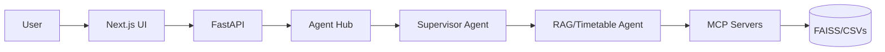

# 🎓 Campus Assistant: Master Interview Guide

> **Objective**: Prepare for a technical interview focused on AI, RAG, and Agentic Workflows. This guide covers every "smallest detail" of the project.

---

## 1. Project High-Level Pitch
**Campus Assistant** is a production-ready AI platform designed to automate student support. It doesn't just "chat"; it routes queries through a multi-agent graph, retrieves real-time data via the Model Context Protocol (MCP), and provides grounded answers with verifiable citations from campus handbooks.

**Key Problem Solved**: Students often struggle to find specific policy info (attendance, credits) or real-time schedules (deadlines, timetables) buried in static documents.

---

## 2. Technical Stack (The "Full Stack AI")
| Layer | technology |
|---|---|
| **Frontend** | Next.js 16 (App Router), Tailwind CSS v4, Lucide React (Icons) |
| **Backend** | FastAPI (Python 3.11+), Uvicorn |
| **Agentic Framework** | LangGraph (Stateful, Multi-Agent Orchestration) |
| **LLM** | Google Gemini 2.5 Flash |
| **Embeddings** | HuggingFace `all-MiniLM-L6-v2` (384 dimensions) |
| **Vector DB** | FAISS (Local flat index) |
| **Protocol** | Model Context Protocol (MCP) using FastMCP |
| **Database** | Supabase (PostgreSQL) for Auth, Chat History, and Telemetry Logs |

---

## 3. The "Smallest Details" (Deep Dives)

### A. RAG Pipeline Implementation
- **Parser**: Uses `pdfplumber` for pixel-perfect text extraction from PDFs. Preserves page numbers which are vital for citations.
- **Chunking Strategy**: Recursive Character Splitting.
  - **Chunk Size**: 600 characters.
  - **Overlap**: 100 characters (ensures no semantic loss at boundaries).
  - **Separators**: `["\n\n", "\n", ". ", " ", ""]`.
- **Hybrid Search Strategy**:
  1. **Dense Search**: FAISS similarity search for semantic meaning.
  2. **Sparse Search**: BM25 keyword matching for specific entities (e.g., Course Codes "CS101").
- **Deduplication**: Results from both searches are merged and deduplicated via MD5-like content hashing.
- **Reranker**: Uses `FlashRank` with the `ms-marco-MiniLM-L-12-v2` model to sort the final results based on query relevance before sending to the LLM.

### B. Agentic Workflow (LangGraph)
The system uses a **Supervisor-Worker** design pattern:
1. **Supervisor Node**: Acts as the router. It uses a Zero-Shot LLM call to classify the intent into: `rag`, `timetable`, `notices`, `planner`, or `general`.
2. **Specialist Agents**:
   - **RAG Agent**: Calls the `Docs MCP` tool to search the knowledge base.
   - **Timetable Agent**: Accesses CSV-based schedules. It includes a "clarification gate"—if the student hasn't provided their group (e.g., "CS-A"), the agent asks for it before searching.
   - **Notice Agent**: Fetches the latest campus announcements.
3. **Response Writer**: Synthesizes the final response. It ensures the output is "grounded" in the retrieved context and includes citations.

### C. MCP (Model Context Protocol)
We implemented three separate MCP servers using the `FastMCP` SDK:
- `docs-server`: Bridges FAISS with the LLM.
- `timetable-server`: Interfaces with `./data/timetable/*.csv`.
- `notices-server`: Interfaces with `notices.json`.
- **Why MCP?**: It decouples the data source from the core AI logic, making the system highly modular and scalable.

---

## 4. Key Engineering Challenges & Solutions
1. **Challenge**: LLM Hallucinations in policy answers.
   - **Solution**: "Hard" RAG. We force the LLM to use only retrieved context. If No info exists, it must say "I don't know." We also add page citations for trust.
2. **Challenge**: Multi-turn context in Agent Graph.
   - **Solution**: LangGraph `GraphState`. We maintain a shared state object that passes history and retrieved data through every node.
3. **Challenge**: Latency in AI responses.
   - **Solution**: SSE (Server-Sent Events) for streaming responses on the frontend, providing immediate feedback despite background processing.

---

## 5. Potential Interview Questions (Q&A)

**Q: Why choose Gemini 2.5 Flash over GPT-4?**
*A: Gemini Flash offers a massive context window (1M+ tokens) and lower latency, making it ideal for processing multiple document chunks and driving intermediate agent steps without high costs.*

**Q: How do you handle document updates?**
*A: We have a "Rebuild Engine" endpoint. When an admin uploads a new PDF, the system triggers the ingestion pipeline: parsing → chunking → embedding → FAISS index update. This is built as an idempotent operation.*

**Q: Why use FAISS instead of a cloud vector database like Pinecone?**
*A: For a campus-sized deployment, FAISS is extremely fast, cost-effective (free), and allows for local data sovereignty. Since the index is small enough to fit in RAM, search latency is sub-10ms.*

**Q: How did you evaluate the system?**
*A: We ran an offline evaluation suite (`eval/runner.py`) using a "Ground Truth" dataset of 80 queries. We measured Intent Routing Accuracy (97.5%) and Citation Accuracy. This ensured the supervisor doesn't misroute queries.*

---

## 6. Project Architecture Diagram (Simplified)

