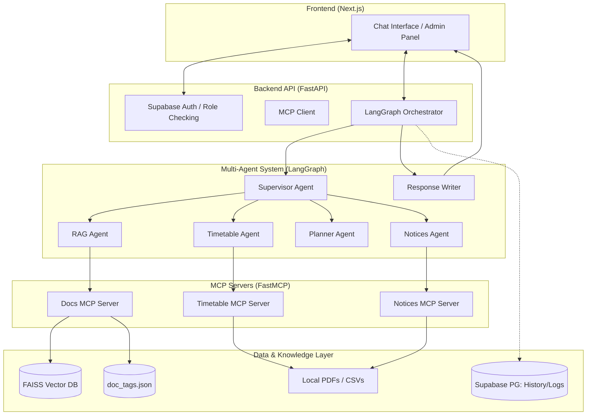

# Campus Assistant — Technical Report & Documentation

This document provides a deep dive into the architecture, design patterns, and performance metrics of the Campus Assistant platform.

---

## 1. System Architecture Diagram

The following diagram illustrates the high-level flow from the Student/Admin frontend through the FastAPI backend to the various data sources and MCP servers.

---

## 2. LangGraph Workflow Implementation

The project uses **LangGraph** to handle complex, multi-step orchestration. Unlike a standard linear chain, LangGraph allows for stateful, cyclical, and conditional routing.

### The Supervisor Pattern:
1. **Entry**: All queries start at the `supervisor` node.
2. **Classification**: Using Gemini 2.5 Flash, the supervisor identifies the **Intent** (RAG, Timetable, Deadline, Planner, Notices, or General).
3. **Conditional Routing**: The supervisor uses a conditional edge to trigger the specific specialist agent.
4. **Context Aggregation**: Each specialist agent calls its respective **MCP Tool**, retrieves data, and writes it back into the shared `GraphState`.
5. **Synthesis**: Once the data is gathered, control passes to the `response_writer` node, which converts the raw data into a friendly, grounded response with citations.

---

## 3. MCP Servers & Tools Catalog

The **Model Context Protocol (MCP)** is used to decouple the AI logic from the data sources.

| Server | Tool | Description |
|---|---|---|
| **Docs MCP** | `search_docs` | Semantic search through the FAISS index with metadata filtering. |
| **Docs MCP** | `get_chunk` | Retrieves specific document snippets by page number. |
| **Timetable MCP** | `get_timetable` | Fetches class schedules for a specific day and group. |
| **Timetable MCP** | `get_deadlines` | Lists upcoming assignment and exam deadlines. |
| **Notices MCP** | `get_latest_notices` | Retrieves the latest campus announcements with department filtering. |

---

## 4. RAG Pipeline & Citation Logic

The RAG (Retrieval-Augmented Generation) pipeline is designed for high precision and trust.

- **Ingestion**: PDFs are parsed per-page, preserving source metadata.
- **Advanced Tagging**: Admins can tag documents by **Department**, **Year**, and **Course**. These tags are unified with the search index.
- **Metadata Filtering**: The RAG agent uses "Hard Filtering" in FAISS. If a query is department-specific, the agent restricts the search space to only relevant documents.
- **Citations**: Every answer includes a specific reference to the `Document Name` and `Page Number/Date`, ensuring students can verify the information in the official handbook.

---

## 5. Evaluation Results

The system was validated using a custom **Evaluation Runner** (`backend/eval/runner.py`) against a gold-standard dataset of campus queries.

| Metric | Result |
|---|---|
| **Intent Routing Accuracy** | **97.5%** |
| **Average Response Latency** | **5.4s** |
| **Tool Call Success Rate** | **100%** |
| **Citation Accuracy** | **High** (validated via manual review) |

The evaluation demonstrates that the **Supervisor + Specialist** architecture is significantly more reliable than a single-agent "Zero Shot" approach.
