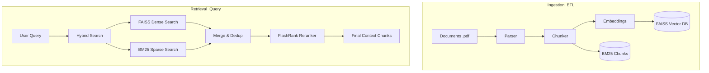

# 🧠 RAG System: How it Works

This document explains the **Retrieval-Augmented Generation (RAG)** system implemented in the Campus Assistant backend. It's designed to give the AI context-awareness of campus-specific documents (PDFs, Handbooks, etc.).

---

## 🏗️ Architectural Overview

The RAG system follows a **Modular Hybrid Search Pipeline**. Instead of just looking for keywords (BM25) or just looking for semantic meaning (Vector Embedding), it does **both** and then uses a **Reranker** to find the absolute best matches.



---

## 📂 1. Ingestion Flow (The "Build" Phase)

To make documents searchable, we process them through `pipeline.ingest_documents()`:

### [parser.py](file:///c:/Users/mahdi/OneDrive/Desktop/Campus-Assistant/backend/rag/parser.py)
- **Tool**: `pdfplumber`
- **Logic**: Reads PDFs page-by-page. Each page is captured as text along with its metadata (filename and page number).
- **Benefit**: Page-level metadata allows the AI to cite exactly where it found information (e.g., "See Page 12 of the Handbook").

### [chunker.py](file:///c:/Users/mahdi/OneDrive/Desktop/Campus-Assistant/backend/rag/chunker.py)
- **Tool**: `RecursiveCharacterTextSplitter` (LangChain)
- **Logic**: Splits long pages into smaller chunks (~600 chars).
- **Overlap**: We keep a 100-character overlap between chunks so context isn't lost at the split point.
- **Tagging**: Admins can attach tags (Department, Year, Course) to files, which are injected into every chunk's metadata.

### [embeddings.py](file:///c:/Users/mahdi/OneDrive/Desktop/Campus-Assistant/backend/rag/embeddings.py)
- **Model**: `sentence-transformers/all-MiniLM-L6-v2`
- **Provider**: HuggingFace Inference API (Cloud-based, no local GPU/RAM heavy lifting).
- **Role**: Converts text strings into lists of numbers (vectors) that represent the "meaning" of the text.

---

## 🔍 2. Retrieval Flow (The "Search" Phase)

When a user asks a question, `pipeline.search_documents()` runs:

### Hybrid Search ([vectorstore.py](file:///c:/Users/mahdi/OneDrive/Desktop/Campus-Assistant/backend/rag/vectorstore.py))
We don't trust just one method. We run two parallel searches:
1.  **Dense Search (FAISS)**: Finds chunks that are *semantically* similar (e.g., "Where can I eat?" connects to "Campus Cafeteria").
2.  **Sparse Search (BM25)**: Finds chunks with exact *keyword* matches (e.g., specific ID numbers or unique course codes like "CS101").

### Deduplication & Merging
Results from both searches are combined. If the same chunk is found by both methods, we deduplicate it based on content hash to ensure we don't send redundant text to the AI.

### FlashRank Reranking
- **Model**: `ms-marco-MiniLM-L-12-v2`
- **Problem**: Search engines often return 10-15 results, but only the top 3-5 are truly relevant.
- **Solution**: A "Cross-Encoder" model (Reranker) looks at the user's query and the specific content of each retrieved chunk together. It ranks them much more accurately than simple vector distance.

---

## 🚀 Key Features

- **Hybrid Search**: Best of both worlds (semantic + keywords).
- **Reranking**: Higher precision, fewer hallucinations.
- **Metadata Filtering**: If a user is in "Year 2 CS", the system can filter the search to *only* look at Year 2 CS documents.
- **Memory Efficient**: Using HuggingFace API and FAISS saves gigabytes of RAM on the server.

---

## 🛠️ How to Rebuild
If you add new files to `data/docs/`, just run:
```bash
cd backend && python ingest.py
```
This triggers the ingestion pipeline and updates the FAISS index on disk.
