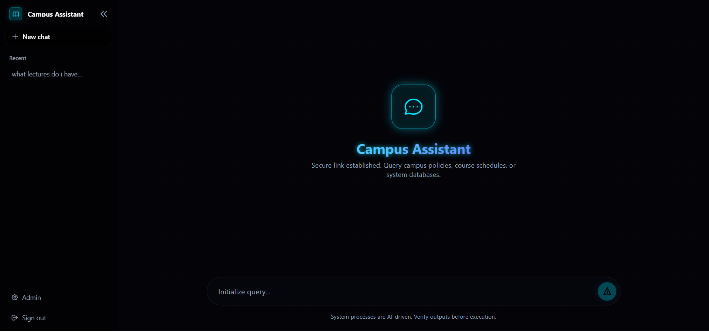
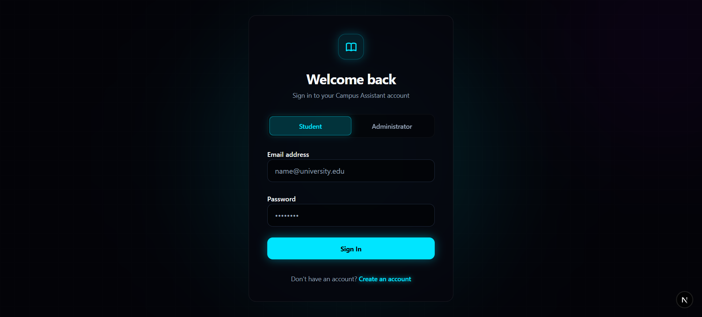
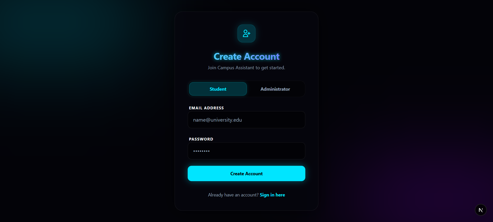
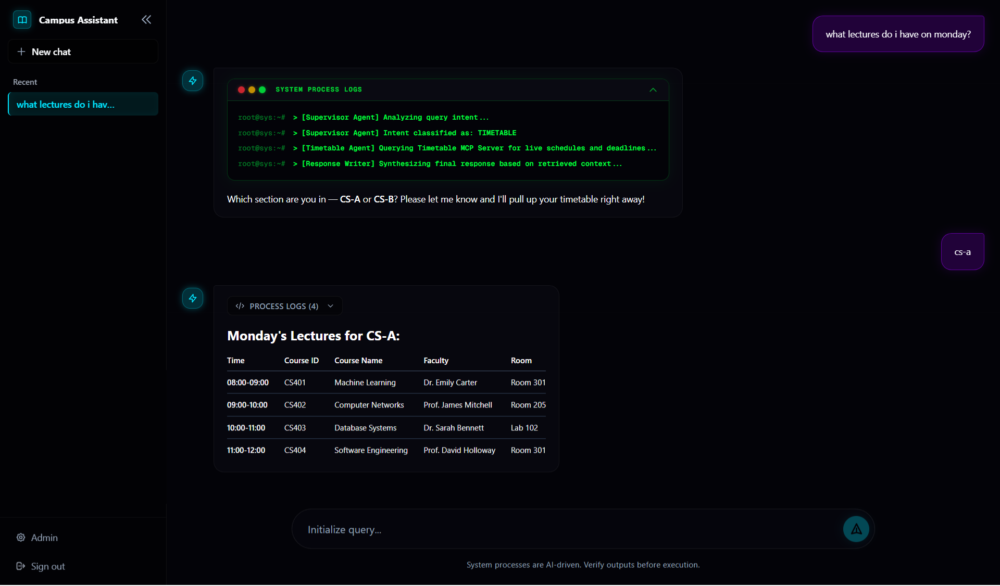
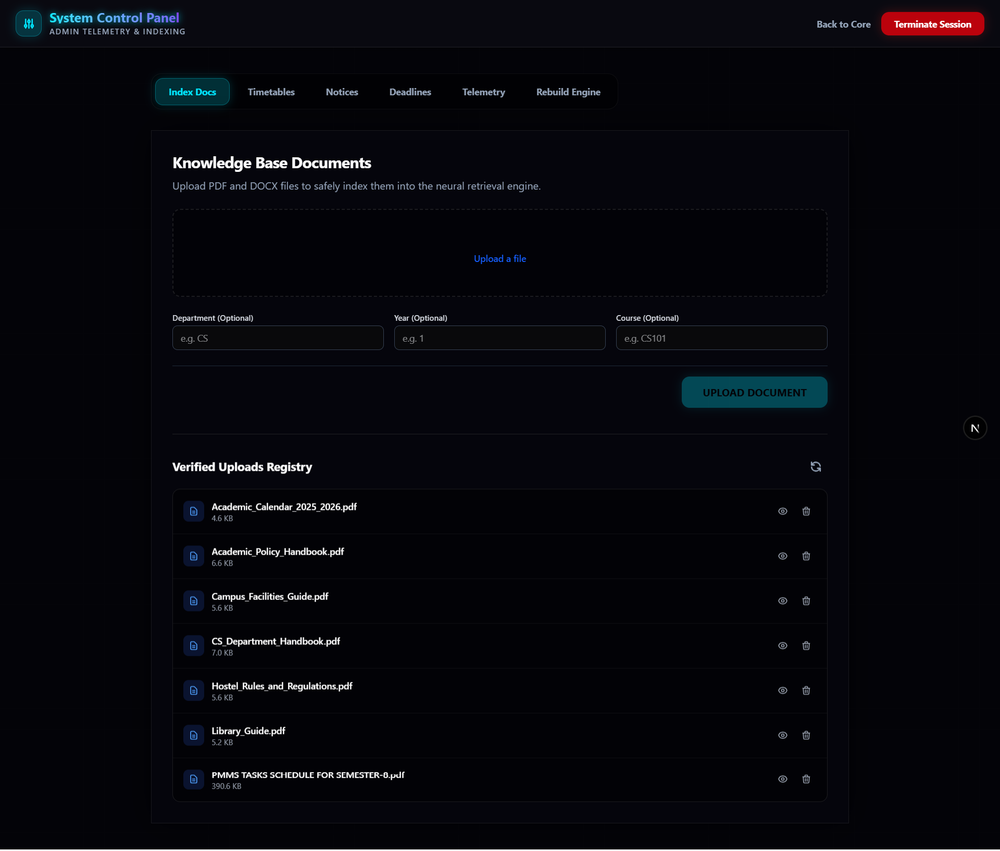
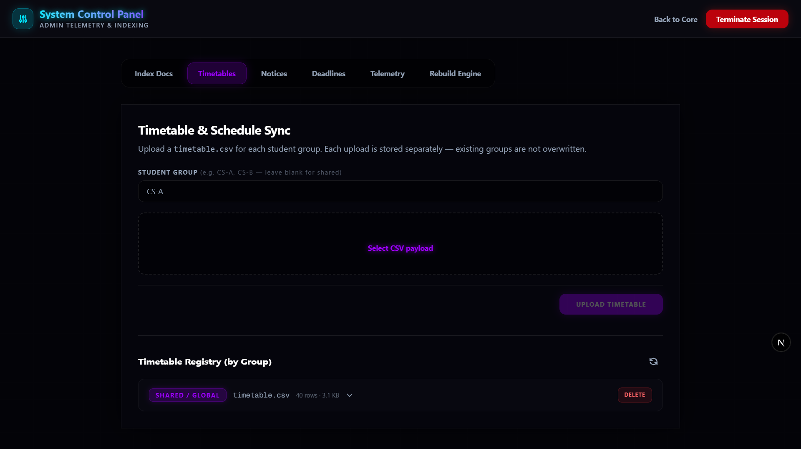
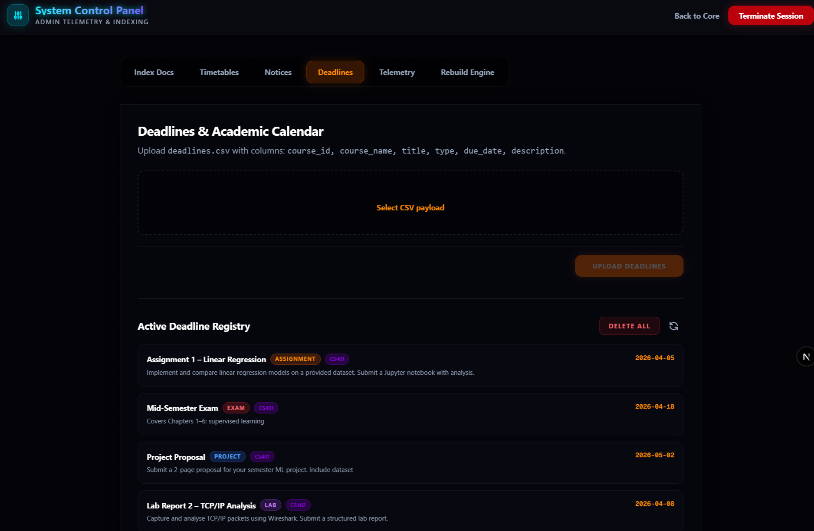
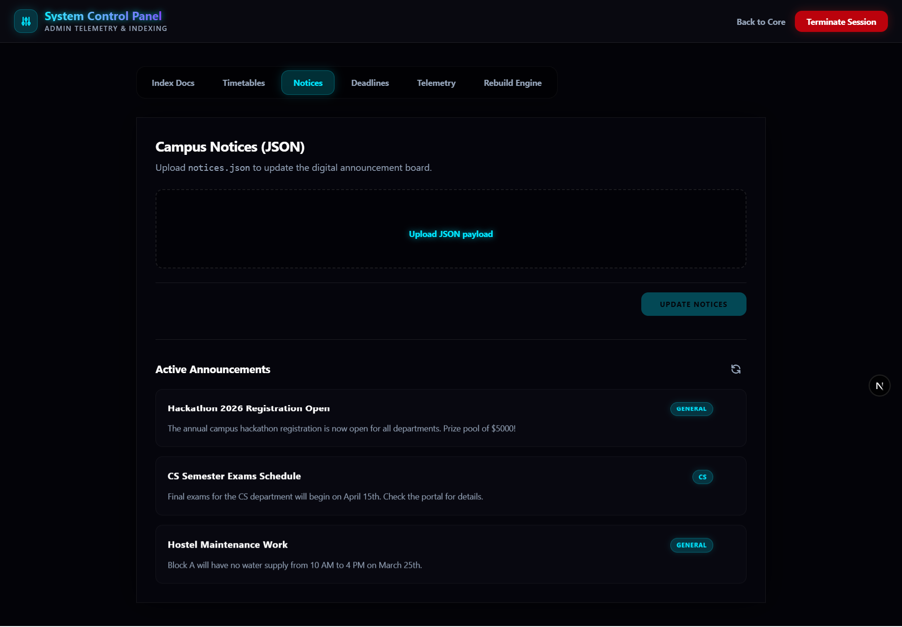
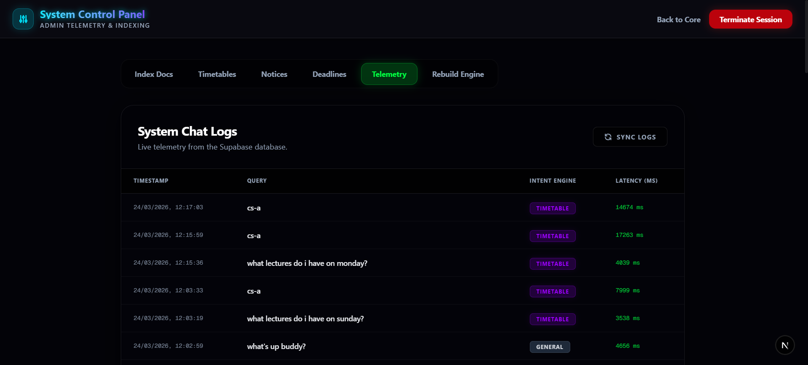
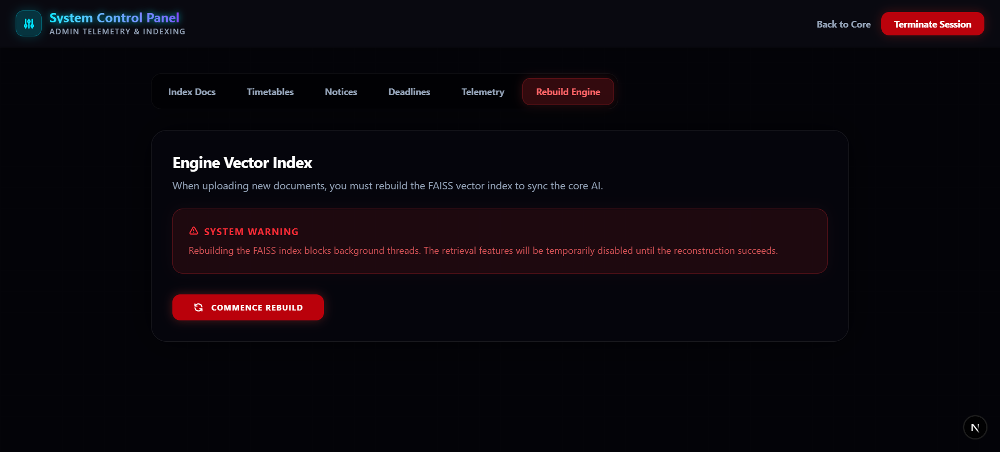

# Campus Assistant

> An enterprise-grade AI campus assistant powered by **LLM + RAG + Multi-Agent LangGraph + MCP**

[](https://nextjs.org)
[](https://fastapi.tiangolo.com)
[](https://langchain.com/langgraph)
[](https://supabase.com)
[](https://ai.google.dev)

---

## Overview

Campus Assistant is a production-ready web application that answers student questions using **Retrieval-Augmented Generation (RAG)**, routes complex queries through a **LangGraph multi-agent graph**, and accesses live campus data (timetables, deadlines, notices) via **Model Context Protocol (MCP)** servers. Admins manage all content through a feature-rich control panel.

---

## Screenshots

### Authentication

<table>
  <tr>
    <td align="center"><br/><sub><b>Home / Landing</b></sub></td>
    <td align="center"><br/><sub><b>Login</b></sub></td>
  </tr>
  <tr>
    <td align="center" colspan="2"><br/><sub><b>Sign Up (Role Selection)</b></sub></td>
  </tr>
</table>

### Student Chat

<table>
  <tr>
    <td align="center"><br/><sub><b>Chat Interface — Streaming AI responses with session history sidebar</b></sub></td>
  </tr>
</table>

### Admin Control Panel

<table>
  <tr>
    <td align="center"><br/><sub><b>Documents — Upload & manage PDFs/DOCX</b></sub></td>
    <td align="center"><br/><sub><b>Timetable — Per-group CSV registry</b></sub></td>
  </tr>
  <tr>
    <td align="center"><br/><sub><b>Deadlines — Color-coded deadline cards</b></sub></td>
    <td align="center"><br/><sub><b>Notices — Per-item delete on hover</b></sub></td>
  </tr>
  <tr>
    <td align="center"><br/><sub><b>Telemetry — Live query logs</b></sub></td>
    <td align="center"><br/><sub><b>Rebuild Engine — Re-index documents</b></sub></td>
  </tr>
</table>

---

## Features

### Student Interface
- **Streaming AI chat** — character-by-character typewriter response effect
- **Persistent chat history** — sessions stored in Supabase, accessible from the sidebar
- **Intent-aware routing** — supervisor agent classifies queries and routes to the right specialist
- **RAG answers with citations** — doc name, page number cited in every document-based response
- **Timetable queries** — per-group schedules (CS-A, CS-B, etc.) via MCP
- **Deadline queries** — upcoming assignment, exam, lab, and project due dates via MCP
- **Notice board** — campus announcements by department
- **"Under the Hood" logs** — expandable system process logs for each response

### Admin Control Panel
| Tab | Features |
|---|---|
| **Documents** | Upload PDF/DOCX with department, year, course tags; view preview; delete per file |
| **Timetable** | Upload per-group CSV (CS-A, CS-B…); view expandable registry per group; delete per group |
| **Deadlines** | Upload deadlines CSV; view color-coded cards by type (Exam, Assignment, Lab, Project, Quiz); delete all |
| **Notices** | Upload notices JSON; view active announcements with per-item delete |
| **Telemetry** | Real-time query logs: intent, latency, user |
| **Rebuild Engine** | Re-chunk, re-embed, and rebuild the FAISS vector index |

---

## Architecture

```
┌──────────────────────────────────────────────┐
│           Frontend — Next.js (App Router)     │
│   Chat UI · Admin Dashboard · Auth Pages      │
│              localhost:3000                   │
└─────────────────────┬────────────────────────┘
                      │ REST / SSE
                      ▼
┌──────────────────────────────────────────────┐
│           Backend — FastAPI (Python)          │
│              localhost:8000                   │
│                                               │
│  ┌─────────────────────────────────────────┐ │
│  │      LangGraph Multi-Agent Graph         │ │
│  │                                          │ │
│  │  Supervisor → RAG Agent                  │ │
│  │           → Timetable Agent              │ │
│  │           → Notice Agent                 │ │
│  │           → Response Writer              │ │
│  └──────────────┬──────────────────────────┘ │
│                 │ MCP (stdio)                 │
└─────────────────┼────────────────────────────┘
        ┌─────────┼──────────┐
        ▼         ▼          ▼
   Docs MCP  Timetable   Notices
   Server    MCP Server  MCP Server
      │           │
      ▼           ▼
  FAISS      timetable_*.csv
  Index      deadlines.csv
```

### Multi-Agent Graph (`backend/graph.py`)

| Agent | Role |
|---|---|
| **Supervisor** | Classifies intent (RAG / timetable / notices / general); deterministically routes short follow-ups |
| **RAG Agent** | Calls Docs MCP → semantic FAISS search → returns chunks with citations |
| **Timetable Agent** | Clarification gate for missing group; calls Timetable MCP |
| **Notice Agent** | Calls Notices MCP for campus announcements |
| **Response Writer** | Synthesises final answer; fast-path for clarification messages |

### Model Context Protocol (MCP)

This project leverage the **Model Context Protocol (MCP)** to connect our AI agents to campus data. MCP is an open standard that enables models to access tools and data sources through a universal, plug-and-play interface.

For a detailed deep-dive into **What, Why, and How** we use MCP, see our **[MCP Guide](MCP_GUIDE.md)**.

| Server | Tools | Data Source |
|---|---|---|
| **Docs** | `search_docs`, `get_chunk` | FAISS vector index |
| **Timetable** | `get_timetable`, `get_deadlines` | `timetable_*.csv`, `deadlines.csv` |
| **Notices** | `get_latest_notices` | `notices.json` |

---

## Tech Stack

| Layer | Technology |
|---|---|
| Frontend | Next.js 16 (App Router), Tailwind CSS v4 |
| Backend | FastAPI, Python 3.11+ |
| Orchestration | LangGraph (LangChain) |
| LLM | Google Gemini 2.5 Flash |
| Embeddings | HuggingFace `all-MiniLM-L6-v2` |
| Vector Store | FAISS (local) |
| Database / Auth | Supabase PostgreSQL |
| MCP Protocol | Python `mcp` SDK + FastMCP |
| Storage | Local filesystem (`./data/`) |

---

## Project Structure

```
Campus-Assistant/
├── frontend/                    # Next.js application
│   ├── app/
│   │   ├── page.tsx             # Chat interface (streaming)
│   │   ├── login/ signup/       # Auth pages (neon dark design)
│   │   ├── admin/               # Admin control panel
│   │   └── components/
│   │       ├── ChatInterface.tsx  # Chat UI with typewriter effect
│   │       └── Sidebar.tsx        # Session history sidebar
│   └── lib/
│       ├── supabase.ts          # Supabase browser client
│       └── api-client.ts        # Authenticated API fetch wrapper
├── backend/
│   ├── main.py                  # FastAPI app — all endpoints
│   ├── graph.py                 # LangGraph agent graph definition
│   ├── mcp_client.py            # MCP client wrappers
│   ├── agents/
│   │   ├── supervisor.py        # Intent classification + routing
│   │   ├── rag_agent.py         # Document retrieval agent
│   │   ├── timetable_agent.py   # Schedule/deadline agent
│   │   ├── notice_agent.py      # Campus notices agent
│   │   └── response_writer.py   # Final answer synthesis
│   ├── rag/                     # RAG pipeline package
│   │   ├── pipeline.py          # Ingest + search orchestrator
│   │   ├── parser.py            # PDF/DOCX parser
│   │   ├── chunker.py           # Text chunker
│   │   ├── embeddings.py        # HuggingFace embeddings
│   │   └── vectorstore.py       # FAISS index management
│   ├── ingest.py                # CLI: rebuild vector index
│   └── .env                     # API keys (do NOT commit)
├── mcp-servers/
│   ├── docs/server.py           # Docs MCP server (FastMCP)
│   ├── timetable/server.py      # Timetable MCP server (FastMCP)
│   └── notices/server.py        # Notices MCP server (FastMCP)
└── data/
    ├── docs/                    # Uploaded PDFs/DOCX
    ├── timetable/               # timetable_*.csv, deadlines.csv
    ├── notices/                 # notices.json
    └── index/                   # FAISS index files
```

---

## Getting Started

### Prerequisites
- Node.js 18+, Python 3.11+, Git

### 1. Clone
```bash
git clone https://github.com/mahdisundarani/Campus-Assistant.git
cd Campus-Assistant
```

### 2. Backend
```bash
cd backend
python -m venv .venv
.venv\Scripts\activate        # Windows
# source .venv/bin/activate   # Linux/Mac

pip install -r requirements.txt

# Create .env (see Environment Variables section below)
python ingest.py              # Build FAISS index from uploaded docs
python -m uvicorn main:app --reload --port 8000
```

### 3. Frontend
```bash
cd frontend
npm install
# Create .env.local (see Environment Variables section below)
npm run dev                   # http://localhost:3000
```

---

## Environment Variables

### `backend/.env`
```env
SUPABASE_URL=<supabase-project-url>
SUPABASE_SERVICE_ROLE_KEY=<supabase-service-role-key>
GOOGLE_API_KEY=<google-gemini-api-key>
HUGGINGFACE_API_KEY=<huggingface-api-key>
```

### `frontend/.env.local`
```env
NEXT_PUBLIC_SUPABASE_URL=<supabase-project-url>
NEXT_PUBLIC_SUPABASE_ANON_KEY=<supabase-anon-key>
```

---

## Key API Endpoints

| Method | Endpoint | Description |
|---|---|---|
| `POST` | `/chat` | Main chat endpoint (SSE streaming) |
| `GET` | `/chat/sessions` | List user's chat sessions |
| `POST` | `/upload` | Upload PDF/DOCX document |
| `POST` | `/upload-timetable` | Upload CSV for a specific student group |
| `POST` | `/upload-deadlines` | Upload deadlines CSV |
| `POST` | `/upload-notices` | Upload notices JSON |
| `POST` | `/rebuild-index` | Re-run FAISS ingestion pipeline |
| `GET` | `/admin/docs` | List uploaded documents |
| `GET` | `/admin/timetable` | List all timetable files by group |
| `GET` | `/admin/deadlines` | View deadlines CSV contents |
| `GET` | `/admin/notices` | View active notices |
| `GET` | `/admin/logs` | Query telemetry logs |
| `DELETE` | `/admin/timetable/{filename}` | Delete a specific group timetable |
| `DELETE` | `/admin/notices/{index}` | Delete a single notice entry |

---

## Data File Formats

### `data/timetable/timetable_CS-A.csv`
```csv
day,time,course_id,course_name,faculty,room,student_group
Monday,08:00-09:00,CS401,Machine Learning,Dr. Emily Carter,Room 301,CS-A
```

### `data/timetable/deadlines.csv`
```csv
course_id,course_name,title,type,due_date,description
CS401,Machine Learning,Assignment 1,Assignment,2026-04-05,Implement linear regression...
```

### `data/notices/notices.json`
```json
[{"title": "...", "content": "...", "department": "CS"}]
```

---

## Deliverables

- 📁 **Source Code**: [github.com/mahdisundarani/Campus-Assistant](https://github.com/mahdisundarani/Campus-Assistant)
- 📄 **[Final Report](REPORT.md)**: Architecture, LangGraph workflows, MCP tool lists, RAG logic, evaluation
